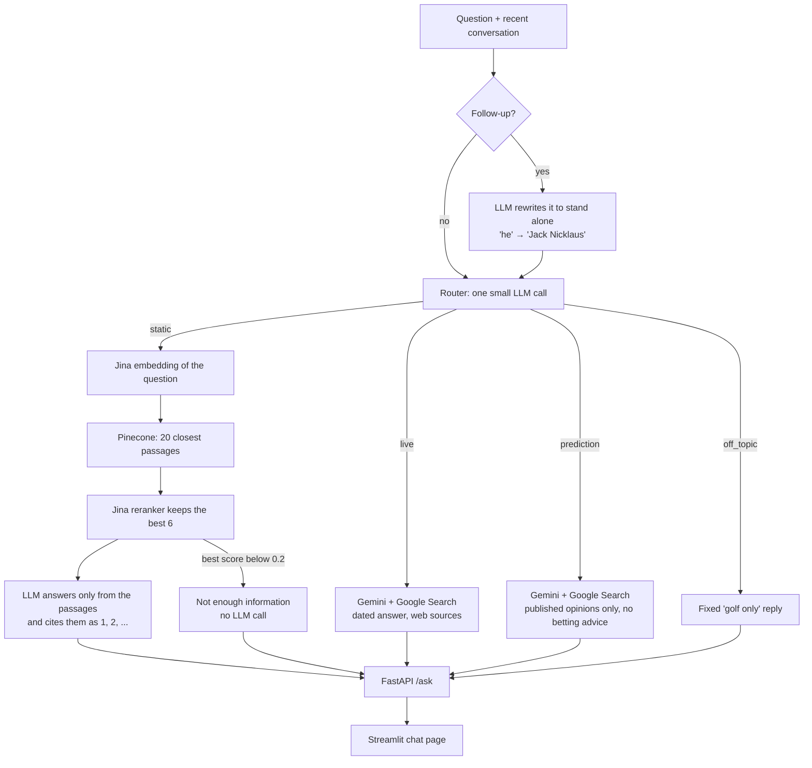
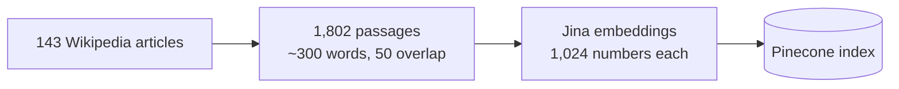

# Golf AI Assistant

[](https://github.com/josephamal10/golf-ai-assistant/actions/workflows/tests.yml)

A golf question-answering assistant built during an internship at Nanonino to learn
LLMs and retrieval-augmented generation (RAG). Every answer cites its sources. Every
question is first routed:

- **static** (rules, history, players, courses, equipment): a RAG pipeline retrieves
  from a vector index of Wikipedia articles and an LLM (Gemini by default, Claude
  optional) answers **only from the retrieved context**, with citations (Phase 1).
- **live** (current rankings, latest results, this week's events, news): Gemini answers
  from a Google Search, with the web pages it used as citations (Phase 2).
- **prediction** (who will win, odds, betting): Gemini searches for published
  predictions and reports them as other people's opinions. It never makes its own
  forecast and never gives betting advice (Phase 2).
- **off_topic** (not golf): a fixed "golf only" reply, with no retrieval or LLM call.

Measured on hand-built eval sets (details in [Eval](#eval)): the right article ranked
first for 100% of answerable questions, 111 of 112 questions routed correctly, and 25/25
hard questions answered correctly end to end.

## Architecture



The knowledge base is built once, ahead of time:



## Quick start for Nanonino colleagues

The Pinecone index is already built, so with the team's keys you only need to:

1. Clone the repo and create the environment (see [Setup](#setup)).
2. Put the team's `JINA_API_KEY`, `PINECONE_API_KEY` and `GOOGLE_API_KEY` in `.env`.
   Get them privately from the project owner; never commit `.env` or paste keys in chat.
3. On Windows double-click `start.bat`, or start the API and UI as in [Run](#run).

You do **not** need to run the ingest steps below.

> [!WARNING]
> **Never run `scripts/embed_and_upsert.py --recreate` against the shared index.** It
> deletes the whole Pinecone index and rebuilds it, which breaks the app for everyone
> until it finishes and spends embedding credit. Only the project owner should rebuild,
> and only after re-chunking or changing the embedding model.

Every question costs a little on the team's paid keys (a fraction of a cent for
knowledge-base answers, a cent or two for web answers), so avoid scripted bulk runs
beyond the evals.

## Stack

| Layer        | Choice                                              |
|--------------|-----------------------------------------------------|
| API          | Python, FastAPI                                     |
| Embeddings   | Jina AI (`jina-embeddings-v4`, 1024-d)              |
| Reranking    | Jina AI (`jina-reranker-v3.5`)                      |
| Vector DB    | Pinecone serverless                                 |
| Generation   | Google Gemini (default) or Anthropic Claude, via `LLM_PROVIDER` |
| Routing      | Same LLM (Gemini, or Claude Haiku), JSON output     |
| Live search  | Gemini grounding with Google Search                 |
| UI           | Streamlit (temporary)                               |
| Sources      | Wikipedia (CC BY-SA) + optional official PDFs       |

## Setup

```powershell
git clone https://github.com/josephamal10/golf-ai-assistant.git
cd golf-ai-assistant
python -m venv .venv
.\.venv\Scripts\Activate.ps1
pip install -r requirements.txt
copy .env.example .env
```

Fill in `JINA_API_KEY`, `PINECONE_API_KEY`, and `GOOGLE_API_KEY` in `.env`. To generate
with Claude instead, set `LLM_PROVIDER=claude` and fill in `ANTHROPIC_API_KEY`.

## Ingest static knowledge

Wikipedia collection does **not** need API keys:

```powershell
python scripts/collect_data.py
python scripts/chunk_data.py
```

Chunking is section-aware: Wikipedia back matter (See also, References, External
links, ...) is dropped, each chunk records its section, and short sections are merged.

Embed and upsert (needs Jina + Pinecone):

```powershell
python scripts/embed_and_upsert.py --recreate
```

`--recreate` deletes and rebuilds the index. Use it after re-chunking or changing the
embedding model, otherwise vectors from the old chunks stay in the index.

Optional: drop a licensed Rules of Golf PDF in `data/raw/pdfs/` and re-run collect
(the PDF collector picks up `*.pdf` in that folder).

## Run

On Windows, double-click `start.bat`: it opens the API (with `--reload`) and the chat
page in two windows and the page opens at http://localhost:8501. Close both windows to
stop. Or start them yourself:

```powershell
# API
uvicorn app.main:app --reload --port 8001

# UI (separate terminal)
streamlit run frontend/streamlit_app.py
```

- Health: `GET http://127.0.0.1:8001/health`
- Ask: `POST http://127.0.0.1:8001/ask` with `{"question": "What is a bogey?"}`

Run Streamlit from the repo root so it picks up the theme in `.streamlit/config.toml`.
The UI shows the active provider and model, disables the composer while the API is
unreachable, and lists the source articles behind every answer, numbered to match the
`[n]` citations. Point it at another API with `GOLF_API_URL`.

Retrieval reranks: Pinecone returns the top `RERANK_CANDIDATES` (20) passages, Jina's
reranker (`jina-reranker-v3.5`) reads the question with each one, and the best
`RETRIEVE_TOP_K` (6) go to the LLM. If even the best passage scores below
`RERANK_MIN_SCORE` (0.2), the answer is "not enough information" with no LLM call. If the
reranker is down, the vector order is used. Set `RERANK_ENABLED=false` to turn it off.

Routing: before anything else, one LLM call labels the question `static`, `live`,
`prediction` or `off_topic` (JSON, temperature 0, with today's date so "this week" means
something). The response's `route` and `route_reason` say which, and the UI shows it
above each answer. If the router call fails, the question takes the static path, so a
router outage never costs an answer. `ROUTER_ENABLED=false` sends everything down the
static path as in Phase 1. A routed question costs one extra small LLM call (~1.7 s).

Live and prediction answers come from Gemini with Google Search grounding. The answer's
`[n]` marks are placed from Google's grounding data and the sources are the web pages
used. If the model answered without any search results behind it, that answer is
replaced with "I could not find current information", since a memory-based answer about
current events would be stale. Google's terms for grounded results apply: the answer is
shown unedited (so the citation clean-up used on static answers is not applied) and the
`search_suggestions_html` it returns must be displayed with it, which the UI does. Each
search the model runs is billed. With `LLM_PROVIDER=claude` or
`LIVE_SEARCH_ENABLED=false`, these questions get a short "live search is not enabled"
reply.

Follow-up questions work: the UI sends the recent conversation as `history`, and when
there is history the API first asks the LLM to rewrite the question to stand alone
("How many majors did he win?" → "How many majors did Jack Nicklaus win?"), then searches
and answers with that. The response's `search_query` shows the rewrite and the UI displays
it. A follow-up therefore costs two LLM calls instead of one.

If the embedding or LLM provider is rate limited or out of quota, `/ask` returns
HTTP 429 with a message instead of a generic 500. Provider outages return HTTP 503 with
the provider's reason; the UI shows both as distinct, actionable messages.

## Eval

Eval set: `data/eval/golf_eval_set.json` (50 questions across categories). Each item has
`expected_contains` (answer keywords) and `expected_sources` (acceptable articles).

Hard set: `data/eval/golf_eval_hard.json` (25 questions): paraphrased terms that don't
name the article, specific facts buried in articles, and 5 questions the knowledge base
can't answer (live results, predictions, betting, non-golf). Those carry an
`expected_route`: the end-to-end eval checks the route, that predictions are labelled
as opinions, that betting questions get no betting advice, and that the non-golf one is
declined. Run either
script on it with `--eval-file data/eval/golf_eval_hard.json`; results go to
`last_*.golf_eval_hard.json`. Out-of-scope items have no expected article, so the
retrieval eval reports them without scoring them.

Retrieval only: no LLM calls, no API server needed, runs in 1–2 minutes:

```powershell
python scripts/evaluate_retrieval.py
```

It reports whether an expected article was retrieved (hit rate, top-1, MRR) and whether
the prompt context contains the expected keywords. Output: `data/eval/last_retrieval_run.json`.

End to end (answers from `/ask`; the API must be running):

```powershell
python scripts/evaluate.py
```

It waits 28 seconds between questions to respect free-tier limits (`--gap 5` is plenty
on a paid Gemini key; much faster than that can trip Jina's rate limit), records a
question that times out and carries on, stops early at the
first HTTP 429, and writes `data/eval/last_run.json`. Use `--limit N` to run fewer and
`--start N` to resume after the first N (a resumed run writes its own `.startN` file).

Follow-ups: `data/eval/golf_eval_followups.json` (6 items) gives each question the earlier
conversation it depends on. The end-to-end eval sends that history; the retrieval eval
searches the raw follow-up, which shows how badly it does without the rewrite.

Router: `data/eval/golf_eval_router.json` (37 questions: live, prediction, off-topic,
and tricky static ones such as "Who won the 1986 Masters?"). The router eval classifies
these plus the original and hard sets (questions with no `expected_route` are static):
one small LLM call per question, no API server needed, about 3 minutes:

```powershell
python scripts/evaluate_router.py
```

It reports accuracy, per-route recall and precision, and every misroute, and writes
`data/eval/last_router_run.json`. The end-to-end eval also fails an answer whose route
differs from the expected one.

## Tests

```powershell
python -m pytest
```

## Source and license notes

- Code: MIT, see [LICENSE](LICENSE).
- Wikipedia text is collected via the MediaWiki API and is CC BY-SA 4.0. Downstream
  answers that quote it should keep attribution (the API already returns source URLs).
- The official Rules of Golf are copyright USGA / R&A. Do not scrape their sites.
  Use Wikipedia for a public summary, or ingest a copy you are licensed to use.

## Project layout

```
app/            FastAPI app, RAG, ingestion
data/catalogs/  Curated Wikipedia title list
data/eval/      Hand-built eval sets (Q&A, hard, follow-ups, router)
frontend/       Streamlit UI
scripts/        collect → chunk → embed → evaluate
tests/          Unit tests (chunker, citations, routing, live answers, API errors)
```
